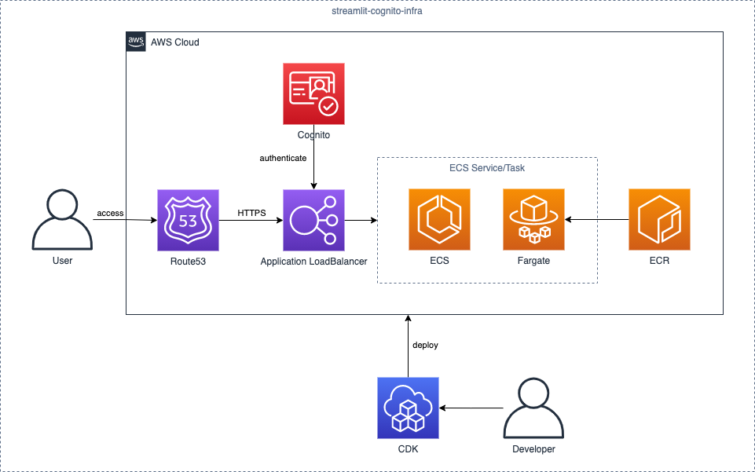

# zenn-streamlit-cognito

[](https://formulae.brew.sh/formula/aws-cdk)
[](https://nodejs.org/ja/)




# zenn article

- [cognitoを利用してstreamlitへのアクセス範囲を限定する](https://zenn.dev/gsy0911/articles/da47b660b7dd2b7d1ae7)
  - see: [tag: CDKv1](https://github.com/gsy0911/zenn-streamlit-cognito/tree/CDKv1)

# deploy step

1. create `infra/params.ts` from example

```shell
$ cp infrastructure/lib/paramsExample.ts infrastructure/lib/params.ts
```

2. prepare your domain in `Route53`
3. get Certificate of your domain in `ACM`

4. edit `params.ts` and set parameters
5. deploy via CDK

```shell
# in infra directory
$ cdk ls
streamlit-cognito

$ cdk deploy
Do you wish to deploy these changes (y/n)? y
...
```

6. access your domain